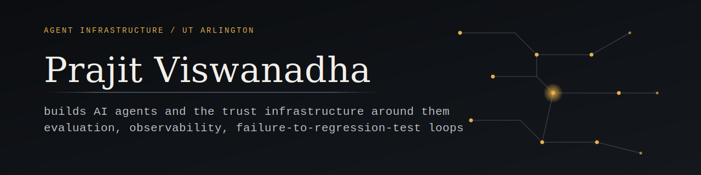

<picture>
  <source media="(prefers-color-scheme: dark)" srcset="assets/banner.svg">
  <source media="(prefers-color-scheme: light)" srcset="assets/banner-light.svg">
  
</picture>

 

I build AI agents and the trust infrastructure around them: evaluation, observability, and failure-to-regression-test loops. Right now that's an intern on Postman's Flows team. CS at UT Arlington.

---

### 🧭 Agent Context Graph
Write-contract compiler for parallel coding agents. Predicts file collisions before agents run, blocks out-of-bounds writes while they run. Tested across three codebases and three backends, including Devin's hosted API.
Private repo, ask me for a walkthrough.

### 🐤 [Canary](https://github.com/vikashftw/Canary)
Dual-oracle QA swarm for bugs that don't throw. A browser agent declares expectations, Sentry reports crashes, the two get matched by trace ID, and the mismatch becomes a regression test. Built with two friends at the UC Berkeley AI Hackathon.

### 📡 [relay](https://github.com/V-prajit/relay)
A Slack `/relay` command becomes a drafted, codebase-aware GitHub issue: acceptance criteria, impacted files. Instant ack inside Slack's 3-second window, the real work happens in the background.

### 🎓 [mavgrades](https://www.mavgrades.com)
ACM UTA's grade-distribution search for UT Arlington. Students use it every registration season. ([repo](https://github.com/acmuta/mavgrades))

### 🛰️ [Polaris](https://github.com/V-prajit/Polaris)
Parking-capacity estimates from satellite imagery. Winner, GrowthFactor Challenge at Hacklytics 2026.

### 📈 [ResourceRadar](https://github.com/V-prajit/ResourceRadar)
Real-time server monitoring: SSH collectors feed Kafka, Kafka feeds InfluxDB, results stream live over WebSockets. One `docker compose up`.

---

  

> Ten hackathon wins taught me how to ship something impressive in 36 hours. The work I actually care about is what happens on hour 37: making the demo survive a second run.

---

<a href="https://www.linkedin.com/in/prajit-viswanadha/">LinkedIn</a>

